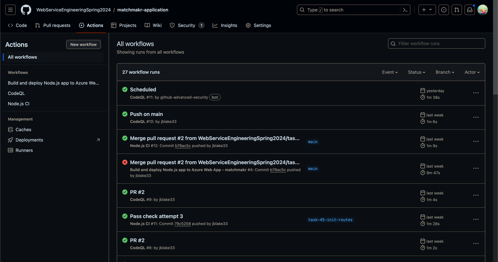
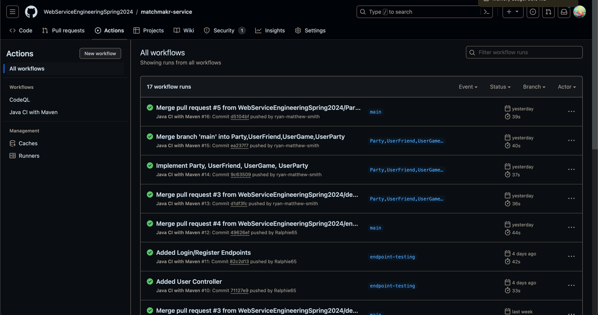

# Sprint 2
## Initial Sprint Goals
- Create automated deployment
- Create back-end API
- Create database schema
- Create CI/CD pipeline
- Create test plan
 
## Sprint Summary
Our team's second sprint was focused on creating the back-end API and database schema. We were able to complete the following tasks:

- Moved monorepo into separate repositories
  - [matchmakr-application](https://github.com/WebServiceEngineeringSpring2024/matchmakr-application)
  - [matchmakr-service](https://github.com/WebServiceEngineeringSpring2024/matchmakr-service)
- Created CI pipelines
  - Front-end 
  - Back-end 
- Created database through digitalocean
- Developed interactive front-end
- Developed back-end API able to access database

### Sprint 2 Burndown Chart

### [Sprint 2 Retro](Matchmakr%20Sprint%202%20Retro.pdf)
## For Next Sprint
