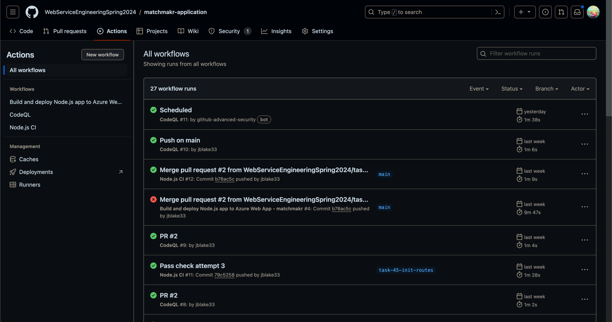
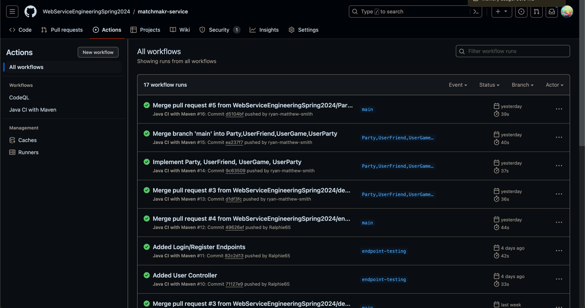

# Sprint 2
## Initial Sprint Goals
- Create automated deployment
- Create back-end API
- Create database schema
- Create CI/CD pipeline
- Create test plan
 
## Sprint Summary
Our team's second sprint was focused on creating the back-end API and database schema. We were able to complete the following tasks:

- Moved monorepo into separate repositories
  - [matchmakr-application](https://github.com/WebServiceEngineeringSpring2024/matchmakr-application)
  - [matchmakr-service](https://github.com/WebServiceEngineeringSpring2024/matchmakr-service)
- Created CI pipelines
- Created database through digitalocean
- Developed interactive front-end
- Developed back-end API able to access database

### Sprint 2 Story Points Forecast
[Story Points Forecast](Story%20Points%20Forecast%20and%20Rationale%20(Sprint2).MD)

### Sprint 2 Kanban Board
[Kanban Board Link](https://webserviceengineering.visualstudio.com/Web%20Service%20Eng.%20-%20Programming%20Project)

### Sprint 2 Burndown Chart

### Sprint 2 Scrum Evidence

### Sprint 2 Mob Evidence

### Sprint 2 CI Evidence

  #### Application CI
  

  #### Service CI
  

### Sprint 2 Retro
[Sprint 2 Retro](Matchmakr%20Sprint%202%20Retro.pdf)

### For Next Sprint
- [High Priority] Create additional tests for service and application features
- [High Priority] Implement the player personality quiz functionality (back and front end)
- [High Priority] Implement the user matchmaking functionality (back and front end)
- [Medium Priority] Add ability to add friends to a matchmaking lobby
- [Low Priority] Add ability to add friends to friend's list
- [Low Priority] Add ability to view a user's profile details.
